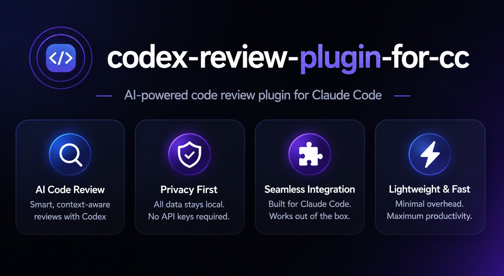

<div align="center">
  
</div>

# codex-review-plugin

Native Claude Code review skills — ported from OpenAI Codex's `/codex:review` and `/codex:adversarial-review` design patterns. Pure Claude implementation, zero external dependencies.

## Included Skills

### codex-review

Standard code review from a senior engineer's balanced perspective.

- **Review dimensions:** Correctness, Security, Performance, Maintainability, Compatibility
- **Output format:** Verdict (`approve` / `needs-attention`) + structured findings + next_steps
- **Severity levels:** critical / high / medium / low (with confidence scores)
- **Supported flags:** `--wait`, `--background`, `--base <ref>`, `--scope auto|working-tree|branch`
- **No custom focus text** (use codex-adversarial-review for that)

### codex-adversarial-review

Adversarial code review — actively tries to break confidence in the change, not validate it. Faithfully ports the Codex adversarial prompt template design.

- **Stance:** Default to skepticism, no compliments, report only material findings
- **Attack surfaces:** 7 categories (auth, data loss, rollback, race conditions, empty-state, version skew, observability)
- **Output format:** Verdict (`approve` / `needs-attention`) + findings (with file:line and confidence) + next_steps
- **Supported flags:** `--wait`, `--background`, `--base <ref>`, `--scope auto|working-tree|branch`, focus text
- **Review-only:** Never modifies any files

## Prerequisites

- [Claude Code](https://docs.anthropic.com/en/docs/claude-code) installed and configured

## Installation

### Option 1: Git Clone (Recommended)

```bash
# 1. Clone the repo
git clone git@github.com:vancelin/codex-review-plugin.git

# 2. Copy skills to Claude Code skills directory
cp -r codex-review-plugin/codex-adversarial-review ~/.claude/skills/
cp -r codex-review-plugin/codex-review ~/.claude/skills/

# 3. Clean up (optional)
rm -rf codex-review-plugin
```

### Option 2: One-liner Install

```bash
cd ~/.claude/skills && \
  git clone git@github.com:vancelin/codex-review-plugin.git /tmp/codex-review-plugin && \
  cp -r /tmp/codex-review-plugin/codex-adversarial-review . && \
  cp -r /tmp/codex-review-plugin/codex-review . && \
  rm -rf /tmp/codex-review-plugin
```

### Option 3: Manual Install

1. Download the latest ZIP from [GitHub](https://github.com/vancelin/codex-review-plugin)
2. Unzip the archive
3. Copy `codex-adversarial-review/` and `codex-review/` to `~/.claude/skills/`

```bash
unzip codex-review-plugin-main.zip
cp -r codex-review-plugin-main/codex-adversarial-review ~/.claude/skills/
cp -r codex-review-plugin-main/codex-review ~/.claude/skills/
```

### Verify Installation

After installing, type `/codex-review` or `/codex-adversarial-review` in Claude Code — the skill should trigger.

You can also verify the files exist:

```bash
ls ~/.claude/skills/codex-review/SKILL.md
ls ~/.claude/skills/codex-adversarial-review/SKILL.md
```

### Uninstall

```bash
rm -rf ~/.claude/skills/codex-review
rm -rf ~/.claude/skills/codex-adversarial-review
```

## Usage

```
# Standard code review
/codex-review
/codex-review --base main

# Adversarial review
/codex-adversarial-review
/codex-adversarial-review security
/codex-adversarial-review --base main --scope branch
```

## Directory Structure

```
codex-review-plugin/
├── README.md
├── codex-adversarial-review/
│   ├── SKILL.md
│   └── references/
│       ├── attack-surfaces.md
│       └── finding-format.md
└── codex-review/
    ├── SKILL.md
    └── references/
        └── review-checklist.md
```

## Design Principles

- **Zero dependencies:** No Codex CLI, Python, or any external tools required
- **Faithful port:** Prompt structure, flags, output format, and review logic match the original Codex plugin
- **Review-only:** Both skills never modify any files
- **Structured output:** Findings include severity, file, line, confidence, and recommendation

## License

MIT

---

# codex-review-plugin（繁體中文）

Claude Code 原生代碼審查 Skills — 參考 OpenAI Codex 的 `/codex:review` 和 `/codex:adversarial-review` 設計模式，以純 Claude 能力實作，零外部依賴。

## 包含 Skills

### codex-review

標準代碼審查，以資深工程師的平衡角度檢查代碼品質。

- **審查維度：** 正確性、安全性、效能、可維護性、相容性
- **輸出格式：** verdict（`approve` / `needs-attention`）+ 結構化 findings + next_steps
- **嚴重度：** critical / high / medium / low（含 confidence 分數）
- **支援 flags：** `--wait`、`--background`、`--base <ref>`、`--scope auto|working-tree|branch`
- **不支援自訂焦點文字**（如需自訂焦點，請使用 codex-adversarial-review）

### codex-adversarial-review

對抗性代碼審查，主動嘗試推翻變更而非驗證它。完全參考 Codex 的 adversarial prompt template 設計。

- **審查立場：** 預設懷疑，不給讚美，只報 material findings
- **Attack surface：** 7 大類（auth、data loss、rollback、race conditions、empty-state、version skew、observability）
- **輸出格式：** verdict（`approve` / `needs-attention`）+ findings（含 file:line 和 confidence）+ next_steps
- **支援 flags：** `--wait`、`--background`、`--base <ref>`、`--scope auto|working-tree|branch`、焦點文字
- **Review-only：** 不修改任何檔案

## 前置需求

- [Claude Code](https://docs.anthropic.com/en/docs/claude-code) 已安裝並啟用

## 安裝

### 方法一：Git Clone（推薦）

```bash
# 1. Clone repo
git clone git@github.com:vancelin/codex-review-plugin.git

# 2. 複製 skills 到 Claude Code skills 目錄
cp -r codex-review-plugin/codex-adversarial-review ~/.claude/skills/
cp -r codex-review-plugin/codex-review ~/.claude/skills/

# 3. 清理（可選）
rm -rf codex-review-plugin
```

### 方法二：一鍵安裝

```bash
# 直接從 GitHub 下載並安裝
cd ~/.claude/skills && \
  git clone git@github.com:vancelin/codex-review-plugin.git /tmp/codex-review-plugin && \
  cp -r /tmp/codex-review-plugin/codex-adversarial-review . && \
  cp -r /tmp/codex-review-plugin/codex-review . && \
  rm -rf /tmp/codex-review-plugin
```

### 方法三：手動安裝

1. 從 [GitHub](https://github.com/vancelin/codex-review-plugin) 下載最新 ZIP
2. 解壓縮
3. 將 `codex-adversarial-review/` 和 `codex-review/` 複製到 `~/.claude/skills/`

```bash
unzip codex-review-plugin-main.zip
cp -r codex-review-plugin-main/codex-adversarial-review ~/.claude/skills/
cp -r codex-review-plugin-main/codex-review ~/.claude/skills/
```

### 驗證安裝

安裝完成後，在 Claude Code 中輸入 `/codex-review` 或 `/codex-adversarial-review`，應能看到 skill 被觸發。

```bash
ls ~/.claude/skills/codex-review/SKILL.md
ls ~/.claude/skills/codex-adversarial-review/SKILL.md
```

### 解除安裝

```bash
rm -rf ~/.claude/skills/codex-review
rm -rf ~/.claude/skills/codex-adversarial-review
```

## 使用方式

```
# 標準代碼審查
/codex-review
/codex-review --base main

# 對抗性審查
/codex-adversarial-review
/codex-adversarial-review security
/codex-adversarial-review --base main --scope branch
```

## 目錄結構

```
codex-review-plugin/
├── README.md
├── codex-adversarial-review/
│   ├── SKILL.md
│   └── references/
│       ├── attack-surfaces.md
│       └── finding-format.md
└── codex-review/
    ├── SKILL.md
    └── references/
        └── review-checklist.md
```

## 設計原則

- **零外部依賴：** 不需要 Codex CLI、Python 或任何外部工具
- **參考原版設計：** prompt 結構、flags、輸出格式、審查邏輯完全參考 Codex 插件
- **Review-only：** 兩個 skill 都不會修改任何檔案
- **結構化輸出：** findings 含 severity、file、line、confidence、recommendation

## License

MIT
